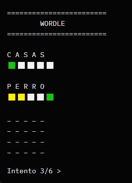

# Wordle (C++ Terminal Edition)

A **terminal-based clone of Wordle**, written in modern **C++17**.  
Guess the hidden five-letter word in six attempts — get colour-coded feedback for every guess!



---

## 🧩 Features

- 6 attempts to guess a 5-letter secret word
- Real-time validation of input
- Accurate duplicate-letter handling (standard Wordle rules)
- ANSI colour-coded feedback:
  - 🟩 **Green** – correct letter in correct position  
  - 🟨 **Yellow** – letter in the word but wrong position  
  - ⬜ **Gray** – letter not in the word
- Cross-platform support (Windows, macOS, Linux)
- Clean modular structure using headers and CMake

---

## 📂 Project Structure

    Wordle/
    ├── .vscode/ # VS Code configuration files
    ├── build/ # Build output (CMake)
    │ ├── CMakeCache.txt
    │ ├── cmake_install.cmake
    │ ├── wordle.exe
    │ └── Makefile
    ├── img/
    │ └── img.png # Screenshot / preview image
    ├── include/ # Header files
    │ ├── Game.hpp
    │ ├── InputHandler.hpp
    │ ├── Renderer.hpp
    │ ├── Utils.hpp
    │ └── WordList.hpp
    ├── src/ # Source files
    │ ├── Game.cpp
    │ ├── InputHandler.cpp
    │ ├── Renderer.cpp
    │ ├── Utils.cpp
    │ ├── WordList.cpp
    │ └── main.cpp
    ├── words/
    │ └── words.txt # Dictionary of allowed words
    ├── CMakeLists.txt # CMake build configuration
    ├── Makefile # Optional manual build script
    ├── run.bat # Windows run helper
    └── README.md # This file


---

## ⚙️ Build Instructions

### 🧱 Using CMake (recommended)
```bash
mkdir -p build
cd build
cmake ..
cmake --build .
```
The compiled binary will appear as:

    ./build/wordle   # Linux/macOS
    build\wordle.exe # Windows

### 🧰 Alternative (Manual Compilation)

    g++ -std=c++17 src/*.cpp -Iinclude -o wordle


## ▶️ How to Play

Run the executable from the project root:
```bash
./build/wordle
```

Then follow the prompts:

1. Type a 5-letter word.

2. Press Enter to submit.

3. Observe the colour feedback:

        🟩 = Correct letter and position

        🟨 = Correct letter, wrong position

        ⬜ = Letter not in the word

4. Guess within 6 tries to win!

## 📘 Word List

The game reads from words/words.txt, containing all valid 5-letter words.
Each word must:

Be lowercase (a–z)

Contain exactly 5 letters

Be written one per line

Example:

    apple
    table
    chair
    perro
    casas

## 🖥️ Terminal Colour Support

The program uses ANSI escape codes for coloured output.
Most modern terminals support this by default:

✅ Linux / macOS Terminal

✅ Windows 10+ PowerShell or Windows Terminal